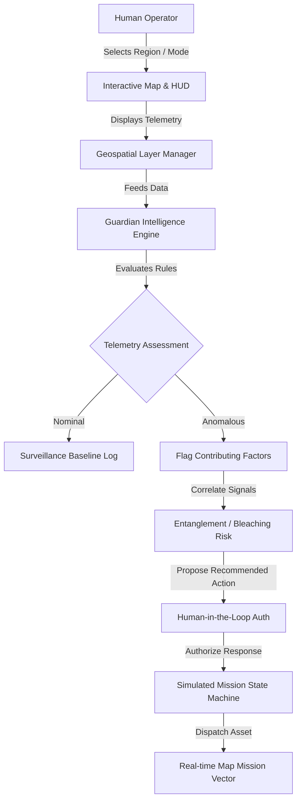

# 🌊 DeepSea Guardian

DeepSea Guardian is an ocean intelligence and conservation monitoring platform that provides a unified mission-control interface for monitoring vulnerable marine regions, environmental conditions, biodiversity, operational assets, and emerging threats.

- **Live Demo:** [https://deepsea-guardian.vercel.app](https://deepsea-guardian.vercel.app)
- **GitHub Repository:** [https://github.com/kaprimayur-dev/Deepsea-guardian](https://github.com/kaprimayur-dev/Deepsea-guardian)
- **Deployment:** Vercel

---

## 📋 Table of Contents

- [🔍 Project Overview](#-project-overview)
- [⚠️ Problem Statement](#-problem-statement)
- [✅ The Solution](#-the-solution)
- [✨ Core Features](#-core-features)
- [🗺️ System Workflow](#%EF%B8%8F-system-workflow)
- [💻 Tech Stack](#-tech-stack)
- [⚙️ Running Locally](#%EF%B8%8F-running-locally)
- [🔐 Environment Variables](#-environment-variables)
- [📦 Project Structure](#-project-structure)
- [📱 Responsive Design](#-responsive-design)
- [⚡ Performance & Production](#-performance--production)
- [♿ SEO & Accessibility](#-seo--accessibility)
- [🖼️ Screenshots](#%EF%B8%8F-screenshots)
- [🚀 Deployment](#-deployment)
- [🗺️ Future Roadmap](#%EF%B8%8F-future-roadmap)
- [🌊 Vision](#-vision)

---

## 🔍 Project Overview

DeepSea Guardian is an ocean monitoring interface designed for marine conservation operators and research scientists. The system integrates diverse marine datasets into a single, cohesive command center, enabling users to:
* **Perform unified ocean monitoring** across disparate telemetry types.
* **Observe regional marine surveillance** across vulnerable, high-value ecological zones.
* **Review environmental intelligence** such as temperatures, dissolved oxygen, currents, and salinity.
* **Assess coral bleaching risks and identify illegal ghost nets** through explainable system logs.
* **Track biodiversity observations** and spatial distributions.
* **Coordinate autonomous operational assets (AUVs)** during threat mitigation.
* **Explore interactive geospatial data layers** using an immersive, responsive HUD interface.

---

## ⚠️ Problem Statement

Ocean monitoring information is highly fragmented. Conservation and science teams typically collect marine data across multiple disconnected streams:
* **Environmental conditions:** Sensor networks tracking SST, currents, salinity, and oxygen.
* **Threats:** Visual reports or acoustic telemetry of illegal/abandoned fishing gear (ghost nets).
* **Biodiversity:** Diver reports, tagging data, and marine life observations.
* **Operational assets:** Coordinates and battery levels of research vessels and autonomous vehicles.

Without a unified system, operators struggle to connect the dots: they cannot easily correlate why a sudden thermal anomaly matches a severe biodiversity drop, which active threats need immediate attention, or where to direct available assets for investigation.

---

## ✅ The Solution

DeepSea Guardian resolves this fragmentation by compiling environmental, threat, biodiversity, and asset streams into an interactive geospatial command center. 

The application offers:
* **Global Monitoring:** A wide-view bathymetry map visualizing marine sanctuaries and regions.
* **Regional Intelligence:** Dive-in analysis cards summarizing specific regional metrics and scores.
* **Guardian System Assessment:** A deterministic correlation engine that evaluates telemetry data to flag potential issues and offer clear recommended actions.
* **Simulated Operations:** A human-in-the-loop operational response protocol to authorize and monitor simulated AUV inspection missions.

---

## ✨ Core Features

### 1. Global Ocean Monitoring
An interactive bathymetric map representing the global ocean system, populated with active regional cores. It allows operators to view global risk statuses at a glance.

### 2. Regional Intelligence
Detailed monitoring of five critical oceanographic sectors:
* **Coral Triangle:** Multi-source monitoring covering habitat stress and illegal driftnet alerts.
* **Mariana Trench:** Deep-ocean research telemetry and benthic drone tracking.
* **Arabian Sea Corridor:** Major shipping lane noise telemetry and marine mammal corridors.
* **Great Barrier Reef Shelf:** Reef health monitoring focusing on thermal stressors.
* **Bay of Bengal Nursery:** Shallow-water estuary telemetry and seasonal spawning tracking.

### 3. Guardian System Assessment
A rule-based intelligence framework that processes local telemetry to generate:
* **Risk Scores & Levels:** From Nominal (0-39) to Critical Attention (80-100).
* **Contributing Factors:** High-impact environmental anomalies (e.g., thermal spike, hypoxia).
* **Cross-Signal Correlations:** Connected events, such as linking a ghost net with endangered species tracking.
* **Deterministic Recommended Actions:** Actionable suggestions (e.g., AUV redirection).

### 4. Threat Intelligence
Real-time tracking of critical ecological events:
* **Ghost Net Detections:** Identification of abandoned commercial nets threatening marine wildlife.
* **Coral Bleaching / Thermal Stress:** Rapid tracking of sustained temperature anomalies.

### 5. Environmental Monitoring
Telemetry charts displaying:
* **Sea Surface Temperature (SST):** Real-time readings compared to baseline averages.
* **Dissolved Oxygen (DO):** Vital stats to identify hypoxia events.
* **Current Velocity:** Speed and directional currents.
* **Salinity:** Level measurements to identify fresh/saltwater shifts.

### 6. Biodiversity Monitoring
Spatial plotting of species observations (e.g., cetaceans, sharks, sea turtles) correlated with regional threats, allowing operators to protect target migration corridors.

### 7. Operational Assets
Monitoring of autonomous assets:
* **Autonomous Underwater Vehicles (AUVs):** Coordinating and dispatching vehicles (e.g., AUV-04) based on threat proximity.
* **Telemetry Tracking:** Tracking battery percentage, speed, location, and operational busy states.

### 8. Interactive Geospatial Mission Control
A responsive dashboard featuring:
* **Interactive Map:** Smooth pan-and-zoom and sector focus transitions using MapLibre GL.
* **Spatial Mode Selector:** Pivot map overlays between **Risk** (regional scores), **Biodiversity** (marine life and threat links), and **Operations** (assets and active mission vectors).
* **Workspace Layer Toggles:** Low-level controls to toggle display of threats, sources, biodiversity observations, and assets.
* **HUD Intelligence Rail:** An informative side panel showing environmental graphs, threat details, and recommended actions.

---

## 🗺️ System Workflow



---

## 💻 Tech Stack

* **Frontend:** React 19, TypeScript, Vite, GSAP (animations)
* **Geospatial:** MapLibre GL JS, MapTiler Cloud (Oceanography Bathymetry Tiles)
* **Icons:** Lucide React
* **Deployment:** Vercel (Production configuration)
* **Version Control:** Git, GitHub

---

## ⚙️ Running Locally

### 1. Clone the Repository
```bash
git clone https://github.com/kaprimayur-dev/Deepsea-guardian.git
cd deepsea-guardian
```

### 2. Install Dependencies
```bash
npm install
```

### 3. Configure Environment Variables
Create a `.env.local` file at the root of the project:
```env
VITE_MAPTILER_KEY=your_maptiler_api_key_here
```
*(Register for a free API key at [MapTiler Cloud](https://cloud.maptiler.com/))*

### 4. Start the Development Server
```bash
npm run dev
```
The application will run locally at `http://localhost:5173`.

---

## 🔐 Environment Variables

* **`VITE_MAPTILER_KEY`**: Authenticates map tile rendering. In production deployments (Vercel), this variable is configured securely inside the environment dashboard with HTTP-origin restrictions applied.

---

## 📦 Project Structure

```text
deepsea-guardian/
├── src/
│   ├── app/                # Application root and route definition
│   ├── components/         # Shared UI components (layout headers, footers)
│   ├── domain/             # DSG-002 Data models, types, and mock repository
│   ├── features/
│   │   ├── landing/        # Cinematic landing page experience and GSAP sections
│   │   └── mission-control/# Mission Control dashboard, HUD widgets, and map
│   ├── guardian/           # DSG-005 Deterministic rule-based assessment engine
│   ├── response/           # DSG-006 Human-authorized response mission simulator
│   └── styles/             # Global Tailwind v4 styles and overrides
├── vercel.json             # Vercel SPA client-side route rewrites
└── index.html              # Core template and SEO metadata
```

---

## 📱 Responsive Design

DeepSea Guardian is fully responsive across desktop, laptop, tablet, and mobile displays:
* **Large Screens:** Side-by-side split layout presenting the interactive map alongside the detailed HUD rail.
* **Estuary/Tablet Views:** Adaptive grids shifting layout items gracefully.
* **Mobile Screens (< 1024px):** Workspace collapses into an optimized vertical stack. The interactive map sits on top, and the HUD intelligence rail scrolls below, maximizing map usability.
* **Touch Optimization:** Responsive mode selection tabs and map layers support touch triggers.

---

## ⚡ Performance & Production

* **Vite-Optimized Bundling:** Employs static asset optimization and chunk minification.
* **Self-Contained Web Worker:** Bundles MapLibre's rendering worker (`maplibre-gl-worker.js`) using Vite's `?worker&url` query pipeline. This eliminates external network requests and solves strict MIME-type checking problems in CDN production builds.
* **Motion Adaptability:** Restrains canvas particles and GSAP scroll triggers when `prefers-reduced-motion` is detected.

---

## ♿ SEO & Accessibility

* **Semantic HTML:** Implements markup using tags like `<header>`, `<main>`, `<section>`, `<aside>`, and `<footer>`.
* **Accessible Headings:** Structures logical hierarchical headings (`h1` for page titles, `h2`/`h3` for features).
* **Color Blindness Adaptability:** Renders risk levels using prominent text labels, numeric scores, and distinct icons rather than depending on color alone.
* **Meta Tags & Social Preview:** Fully configured Open Graph descriptions, title tags, and keywords in `index.html`.

---

## 🖼️ Screenshots

*Screenshots to be added after deployment:*
1. **Landing Experience:** Immersive underwater aesthetic highlighting the platform’s mission.
2. **Unified Mission Control:** The primary dashboard presenting the active global ocean view.
3. **Coral Triangle Analysis:** Detailed Guardian analysis rail highlighting a critical bleaching threat.
4. **Active Response Dispatch:** Visual map vectors tracking an authorized AUV en-route to clear a ghost net.

---

## 🚀 Deployment

The frontend is deployed through Vercel. Continuous Integration builds the bundle on every commit pushed to the `main` branch. 

*   **Production Deployment URL:** [https://deepsea-guardian.vercel.app](https://deepsea-guardian.vercel.app)
*   **Vercel Routing:** Configuration rewritten in `vercel.json` to handle SPA route fallback to `index.html`.

---

## 🗺️ Future Roadmap

*(Planned Capabilities)*
* **Real-time Ingestion:** Connect live oceanographic feeds (NOAA, Copernicus Marine Service).
* **Satellite Observations:** Overlay active satellite raster bands for chlorophyll and SST.
* **AIS Transponder Integration:** Track active commercial vessel coordinates inside conservation corridors.
* **Predictive ML Analytics:** Implement deep learning models to predict bleaching events weeks in advance.
* **SMS & Webhook Alerts:** Notify local ranger forces immediately when high-confidence illegal fishing markers appear.

---

## 🌊 Vision

DeepSea Guardian transforms fragmented, complex ocean observations into clear, understandable, and actionable intelligence—enabling human operators to protect our marine sanctuaries with speed, precision, and confidence.

